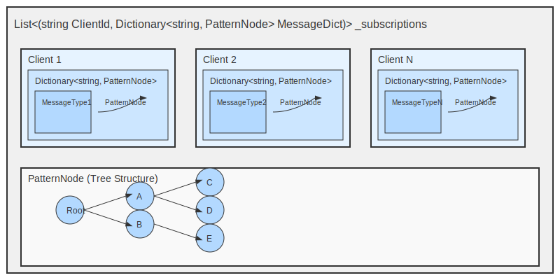
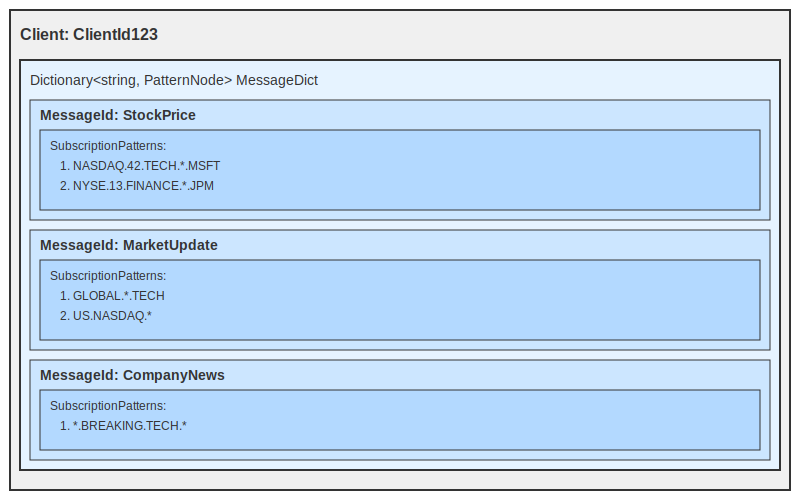
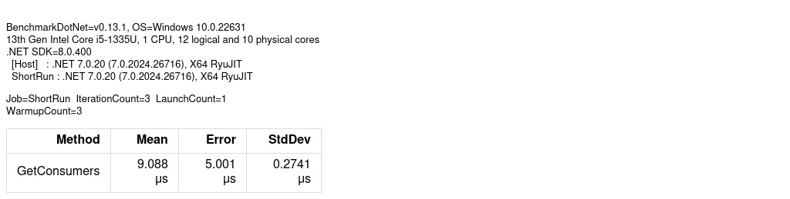

# SubscriptionIndex performance
    
  My approach:
  To achieve better performance, I focused on improving data representation and leveraging parallel processing. 
  Here's the breakdown of my approach:

  1. **Initial Structure and Performance**:
      Initially, I represented subscriptions as a nested dictionary in this format:
      `Dictionary<string, Dictionary<string, HashSet<string>>>`. 
      - The first dictionary's key was the `messageId`, the second dictionary's key was the `clients` registered for that messageId, and the `HashSet` contained the subscription patterns for each client.
      - However, this approach resulted in a performance of around **100 milliseconds** due to inefficient lookups.

  2. **Reorganizing Data Representation**:
      Based on the provided data distribution—1000+ consumers, 5000+ subscriptions per consumer, and up to 2000+ subscriptions per consumer for a given message type
      I recognized that `clients` should be the first-level key, not the `messageId`.
      - By switching the structure to make consumers the top-level key, I saw significant improvement, with performance now at around **1 millisecond**.

  3. **Optimizing with a Tree Structure**:
  
      To further optimize, I decided to represent each client's `messageId` subscriptions as a **tree**. 
      
      
      
      This allowed us to:
      - Search for a pattern in the tree from root to children efficiently.
      - Instead of looping through all subscriptions, we could quickly determine whether a subscription matches the message.
      - This optimization brought the performance down to **20 microseconds**.

  4. **Parallel Processing and Early Exits**:
      To hit the target of less than 10 microseconds, 
      - I switched to using `Parallel.ForEach` at the client level (first level key), which performed better than `Task.WhenAll` in this scenario.
      - Additionally, I introduced **early exit conditions** in various methods to avoid unnecessary processing when a match was found early.
  
  By improving data organization and using parallel processing at the right level, I was able to reach a benchmark execution time of under **9 microseconds**.
    
